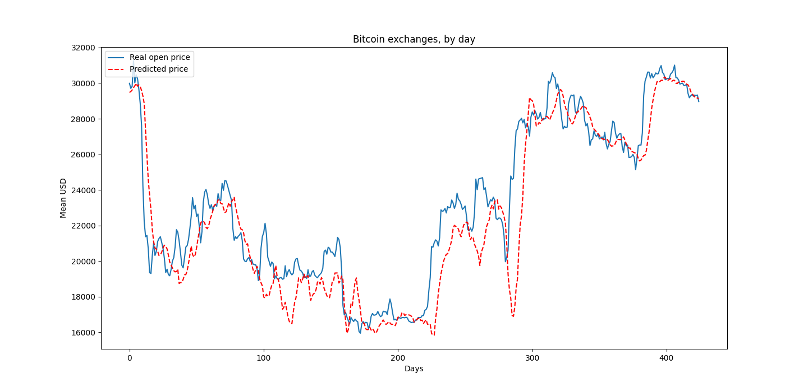

# 比特幣價格趨勢預測

- [比特幣價格趨勢預測](#比特幣價格趨勢預測)
  - [開發動機](#開發動機)
  - [資料集](#資料集)
  - [開發過程](#開發過程)
  - [預測結果](#預測結果)
  - [遇到的困難](#遇到的困難)
  - [總結](#總結)

## 開發動機

由於在本學期修習到的 AI 課程中觀摩到他人對於股票預測的模型，進而想嘗試自己建立一個神經網路模型來預測比特幣價格。

## 資料集

選用 Kaggle 上的 [比特幣資料集 (2017-2023)](https://www.kaggle.com/datasets/jkraak/bitcoin-price-dataset) 

## 開發過程

由於比特幣是屬於**時間序列資料**，所以選用具有記憶性的 **LSTM** 神經網路。

透過不斷調整超參數，最終得到建立雙層 LSTM 神經網路的效果較好，細節如下：
- 第一層：64 個神經元，使用 **tanh** 作為激活函數
- 第二層：128 個神經元，使用 **Relu** 作為激活函數

## 預測結果

## 遇到的困難

在開發過程中，曾遇到過 **MSE(Mean Squared Error)** 很小，但視覺化後的結果卻不如預期的情況，故推測訓練模型的過程出現了 **overfitting** 的現象。經由調整資料前處理方法和 LSTM 神經元個數，最後將第一層的激活函數改為 **tanh** 後，得到較好的視覺化預測結果。

## 總結

即使預測模型有能力依照過去的資料去推測比特幣價格走勢，但若僅以此預測作為根據，來購買未來的股票，還仍有些不妥。由於比特幣的短期走向，仍取決於許多不可預知的**突發事件**，故僅由過去的資料預測結果來進行購買，可能缺少了突發事件這個關鍵因素。

但我認為，若把預測的結果，當作一個決策的**特徵值**，是一個不錯的做法。結合近期的 ChatGPT，或許可以打造一個更全面的 **AI 股票顧問。**